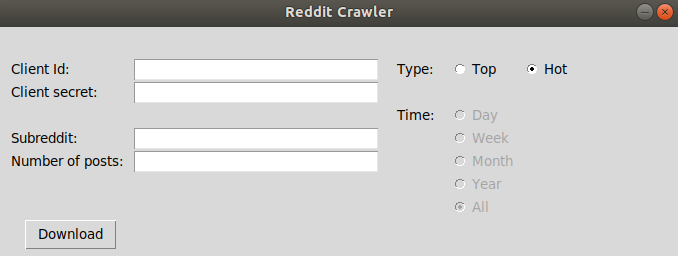

# RedditCrawler

## So, what is this whole thing all about?
RedditCrawler is a tool to easily retrieve content from reddit and put it into a .pdf-file. I personally use it mostly to compile a little e-book of posts from /r/nosleep, but it works for a lot of different subreddits, too! Notice that only plain text will be put into the .pdf-file so this program is mainly for text-based subs.

## And how does it work?
There are some python dependencies you need! Install all the ones listed in requirements.txt!

Unfortunately, we cannot just call the Reddit-API to retrieve posts without any preparation. First of all you need to go to https://www.reddit.com/prefs/apps and login to reddit. When I go there, my site looks like this:


If you use third-party apps to browse reddit on your phone, they will also show up. Now hit the "create another app..." button at the bottom. The following form will appear:


Most of the things here do not really matter: Fill out name, description, about url and redirect url with whatever you want. One thing matters, though: the default selection above is "web app". Change this to "script" and hit "create app".

Congratulations, you are a developer now! (lol) If you click the "edit" button on your app, you will see something like this:


In order to access the Reddit-API you need two things: the client-id (right below "personal use script") and the client secret a.k.a. secret.

## And how can I use your program now??

There is a command-line and a graphical client. To use the command-line client you have to edit the config.txt file. This file looks like this:

```
[config]
limit = 50
credential_path = /home/fabian/Dokumente/reddit_credentials.txt
type = top
top_time = month
subreddit = nosleep
```

What do all this things mean?

* limit: the number of posts that you want to retrieve (do not try something like a billion or so plz, I am afraid everything will crash, thanks)
* credential_path: path to a file with your credentials (see below)
* type: can be top, hot or new
* top_time: can be day, week, month, year or call
* subreddit: the name of the subreddit you want to get posts from

I didn't put my client id and client secret directly in the config while because I was afraid I might accidently push them to GitHub. So, to protect me from my own stupidity, I put them in a separate file. This file has to look like this:

```
[credentials]
client_id = [your-client-id]
client_secret = [your-client-secret]
```

If you did all your changes, just run the crawler.py file from the main directory. This will create a folder named "pdf_output" and put your .pdf-file there.


But you can also use the graphical client. Just execute interface.py in the ui/ directory. A window like this will show up:



Just fill out the form and hit "Download". This allows you to select a download directory.

Have fun and please don't break stuff!! (づ｡◕‿‿◕｡)づ
